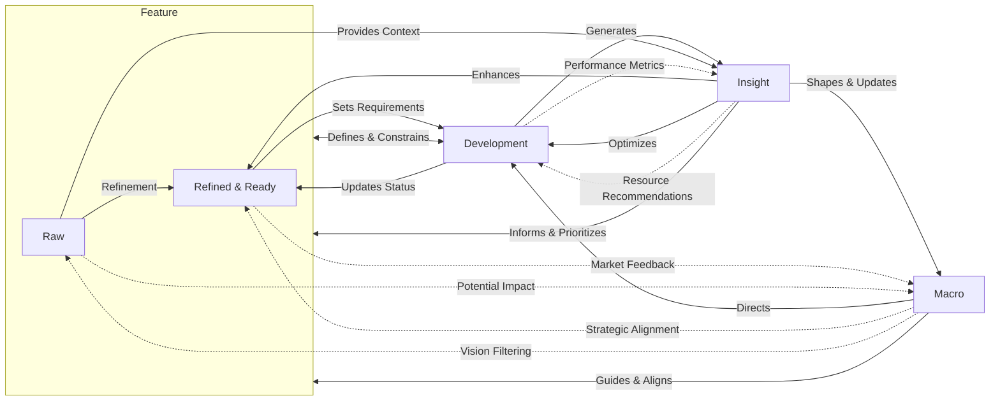

# Y.FDI (Feature, Development, and Insight)

Y.FDI is an AI-driven system for managing product development, from feature ideation to development tracking and insight generation.

## Overview

Y.FDI streamlines the product development process by integrating feature management, development tracking, and insight generation into a unified system. It leverages AI to process and analyze data from various sources, providing a comprehensive view of your product development lifecycle.

## Core Components

### Features

#### Raw Features

- Unprocessed feature requests and ideas
- Sources: GitHub issues, Discord messages, emails, internal discussions
- Stored in their original form for reference and processing

#### Refined Features

- Processed and analyzed version of raw features
- Stored in a vector database for efficient retrieval and searching
- Linked to multiple implementation strategies (meta features)
- Also recorded in a relational database for backup and additional purposes

### Development

- Tracks the status of ongoing development efforts
- Manages resource allocation (human resources, computing power, etc.)
- Provides real-time insights into project progress and resource utilization

### Macro

- Houses high-level guiding information for the organization
- Includes vision, positioning, objectives, and strategic decisions
- Defines what the organization does and doesn't do, along with the reasoning

### Insight

- Pervasive throughout the system
- Can be attached as comments to features, development tasks, or macro items
- Sources include human input and AI-generated analysis
- May also exist as standalone articles or reports

### Graphs

## Technical Architecture

- Backend: Django with Django-ninja for API development
- AI Integration: Dify for workflow orchestration
- Database: Combination of relational database and vector database

For more detailed technical information and setup instructions, please refer to [DEV.md](/light/README.dev.light.md).

## Getting Started

1. Clone the repository
2. Install dependencies (see [DEV.md](/light/README.dev.light.md) for details)
3. Set up the databases and Dify integration
4. Run the Django development server

## Roadmap

- [ ] Implement advanced AI-driven feature analysis
- [ ] Develop a user-friendly frontend interface
- [ ] Enhance integration with popular project management tools
- [ ] Implement advanced visualization for insights and development progress

## Licensing

Y.FDI is dual-licensed:

1. [GNU Affero General Public License v3.0 (AGPL-3.0)](LICENSE)
2. Commercial License

For commercial use without AGPL-3.0 obligations, please [contact us](mailto:email@alterxyz.org).

## Support

For questions, feature requests, or support, please open an issue in the GitHub repository or contact us directly at [contact us](mailto:email@alterxyz.org)

---

Y.FDI is currently in alpha. We appreciate your feedback and contributions as we work to improve and expand the system.
